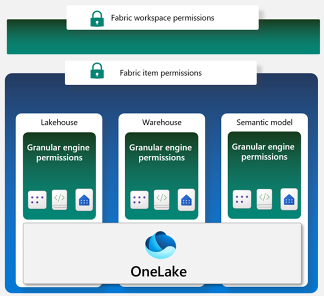

Data access in organizations is often restricted by users' responsibilities, and roles and by an organization's [Fabric deployment patterns,](/azure/architecture/analytics/architecture/fabric-deployment-patterns?azure-portal=true) and [data architecture](https://learn.microsoft.com/en-us/fabric/onelake/security/how-to-common-data-architectures). Fabric has a flexible, multi-layer security model that allows you to configure security to accommodate different data access requirements. Having the ability to control permissions at different layers means you can adhere to the principle of least privilege, restricting user permissions to only what's needed to perform job tasks.

Fabric has three security levels and they're evaluated sequentially to determine whether a user has data access. The order of evaluation for access is:  
1. Microsoft Entra ID authentication: checks if the user can authenticate to the Azure identity and access management service: [Microsoft Entra ID tenant](https://techcommunity.microsoft.com/t5/core-infrastructure-and-security/microsoft-entra-id-tenant-starters-guide-understanding-identity/ba-p/4154857).
2. Fabric access: checks if the user can access Fabric.
3. Data security: checks if the user can perform the action they've requested on a table or file.  

The third level, data security, has several building blocks that be configured individually or together to align with different access requirements. The primary access controls in Fabric are:

- Workspace roles
- Item permissions
- Compute permissions
- OneLake data access controls (preview)

It's helpful to envision these building blocks in a hierarchy to understand how access controls can be applied individually or together.

A *workspace* in Fabric enables you to distribute ownership and access policies using *workspace roles*. Within a workspace, you can create Fabric data *items* like lakehouses, data warehouses, and semantic models. *Item permissions* can be inherited from a workspace role or set individually by sharing an item. Items are shared using item permissions when workspace roles are too permissive.  

Within each data item, *granular engine permissions* such as Read, ReadData, or ReadAll can be applied. 

Compute permissions can be applied within a specific compute engine in Fabric, like the SQL Endpoint or semantic model.

Fabric data items store their data in OneLake. Access to data in the lakehouse can be restricted to specific files or folders using the role-based-access control (RBAC) feature called *OneLake data access controls (preview)*.