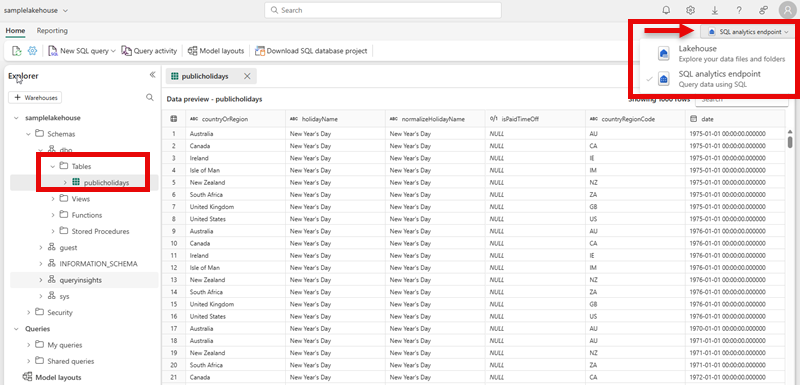
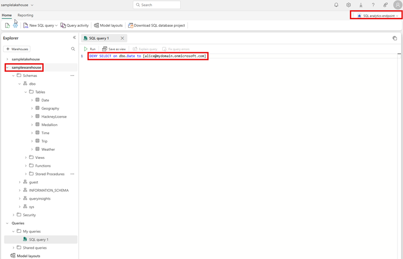

When the permissions provided by workspace roles or item permissions are insufficient, granular permissions like table and row-level security and file and folder access can be set through the:

- SQL analytics endpoint
- OneLake data access roles (preview)
- Warehouse
- Semantic model

## Configure data access through the SQL analytics endpoint in a lakehouse
Data in a lakehouse can be read through the SQL analytics endpoint. Each Lakehouse has an autogenerated SQL analytics endpoint that can be used to transition between the *lake* view of the lakehouse and the *SQL* view of the lakehouse. The *lake* view supports data engineering and Apache Spark and the *SQL* view of the same lakehouse allows you to create views, functions, stored procedures and to apply SQL security and object level permissions.

Data in a Fabric lakehouse is stored with the following folder structure:
- /Files
- /Tables

### View the SQL analytics endpoint view of the lakehouse
The SQL analytics endpoint is used to read data in the /Tables folder of the lakehouse using T-SQL.
 

### Apply granular permissions to the lakehouse using T-SQL
Using the SQL analytics endpoint, granular T-SQL permissions can be applied to SQL objects using Data Control Language (DCL) commands such as:
- [GRANT](../sql/t-sql/statements/grant-transact-sql) 
- [DENY](../sql/t-sql/statements/deny-transact-sql) 
- [REVOKE](../sql/t-sql/statements/revoke-database-permissions-transact-sql) 

Row-level security, column-level security, and dynamic data masking can also be applied using the SQL analytics endpoint. See:

- [Row-level security](../fabric/data-warehouse/row-level-security) 
- [Column-level security](../fabric/data-warehouse/column-level-security)
- [Dynamic data masking](../fabric/data-warehouse/dynamic-data-masking)

## Configure data access through the lake view of the lakehouse
The lake view of the lakehouse is used to read data in the /Tables and /Files folder of the lakehouse.

 

### Use OneLake data access roles to secure data
Workspace and item permissions provide coarse access to data in a lakehouse. To further refine data access, folders in the lake view of the lakehouse can be secured using OneLake data access roles (preview). You can create custom roles within a lakehouse and grant read permissions only to specific folders in OneLake. Folder security is inheritable to all subfolders. To create a custom OneLake data access role:

1. Select **Manage OneLake data access (preview)** from the menu in the lake view of the lakehouse.
 

2. In the **New Role** window, create a new role name and select the folders to grant access to.
 

3. Once the role is created, assign a user or group to the role and select the permissions to assign.
  

> Tip
> For more information on how OneLake RBAC permissions are evaluated with workspace and item permissions, see: [How OneLake RBAC permissions are evaluated with Fabric permissions](https://learn.microsoft.com/en-us/fabric/onelake/security/data-access-control-model#how-onelake-rbac-permissions-are-evaluated-with-fabric-permissions)

### Configure granular warehouse permissions
Granular permissions can be applied to warehouses using the SQL analytics endpoint, similar to the way the endpoint is used for the lakehouse. The same permissions can be applied: GRANT, REVOKE, and DENY and row-level security, column-level security, and dynamic data masking.  

 

### Configure Semantic model permissions
A user's role in a workspace implicitly grants them permission on the semantic models in a workspace. Semantic models allow for security to be defined using DAX.  More granular permission can be applied using row-level security (RLS). To learn more about the managing RLS or permissions on the semantic model see:

[Semantic model permissions](../power-bi/connect-data/service-datasets-permissions)
[Row-level security (RLS) with Power BI](../fabric/security/service-admin-row-level-security)
