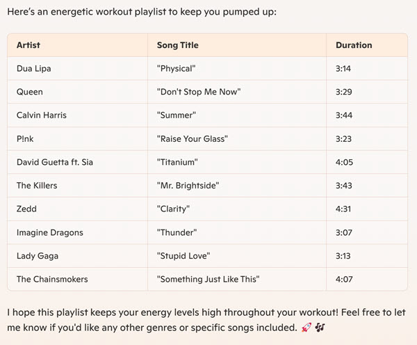

To get the best out of the AI, you want to create prompts that help it give you useful responses. A **prompt** is simply a question or instruction you submit to get a specific response. It's like asking a friend or coworker for help or information, but instead, you're asking an AI, like Microsoft Copilot. The clearer and more detailed your prompt, the better Copilot can understand and respond. It's often more effective to tell Copilot what you *want* it to do, rather than what you *don't want* it to do.

## Write effective prompts

An effective prompt should be clear, specific, contextual, and goal oriented. By incorporating these elements into your prompts, you can ensure that you get more accurate and relevant responses from AI tools. Remember, the more information and guidance you provide in your prompt, the better Copilot can assist you.

Here are some tips to keep in mind when writing a prompt:

- Be specific about what you want Copilot to do. Clear goals lead to better responses.
- Add some context to help Copilot understand what you're asking. Context makes the response more relevant.
- Let Copilot know how you want the response to be formatted. This sets clear expectations.
- Provide some data or information for Copilot to use. This helps ground the response in the right context.

> [!NOTE]
> With Copilot, you can **iterate** by asking it to refine the results, so don't worry if you don't get the response you want the first time. Let's say you used Copilot to create a menu for a dinner party, but you forgot you need to include vegetarian options. Simply ask Copilot to update the menu to include a vegetarian dish. This way, you can keep refining your prompts until you get the perfect result.
>
> 

The following table includes some everyday tasks that you could co-create with AI, and include examples of good, better, and best prompts. These examples will help you understand how to create prompts to make your tasks more simple and effective.

| **Task** | **Good** | **Better** | **Best** |
|----------------|------|--------|------|
| **Rewrite Emails** | Copilot, rewrite this email to be more formal: [email text]. | Copilot, rewrite this email to be more formal and concise: [email text]. | Copilot, rewrite this email to be more formal, concise, and persuasive: [email text]. |
| **Brainstorm Podcast Ideas** | I'm thinking about starting a personal podcast. Can you help me brainstorm a month's worth of episode ideas centered around [technology, culture, and personal development]? | I'm thinking about starting a personal podcast. Can you help me brainstorm a month's worth of episode ideas centered around [technology, culture, and personal development]? Each episode should cover a unique article. | I'm thinking about starting a personal podcast. Can you help me brainstorm a month's worth of episode ideas centered around [technology, culture, and personal development]? Each episode should cover a unique article that would intrigue listeners. For each episode idea, provide a catchy title and a brief outline of key discussion points. |
| **Create a Playlist** | Copilot, create a playlist for [my workout]. | Copilot, create a playlist for [my workout] with 10 [upbeat and energetic] songs. | Copilot, create a playlist for [my workout] with [upbeat and energetic] songs. Include a mix of [pop, rock, and electronic music] to keep the energy [high]. Format the playlist as a table with [the artist, the name of the song, and how long each song is]. |

The following image shows the playlist Copilot generated using the "best" prompt example. Note that it's formatted as a table and includes all of the requested details for each song.  

Now that you know what it takes to craft effective prompts, try to identify tasks in your own daily routine where AI might help you save time or be more creative.

> [!TIP] 
> **Build your AI habit:**
> Now that you understand how to craft clear, specific, and goal-oriented prompts, try to identify tasks in your own daily routine where AI might help you save time or be more creative. Commit to a daily experiment, such as one prompt to try every day. Remember to iterate as much as you want to perfect your prompt.

Next, let's dig a little deeper into the art of prompting.
