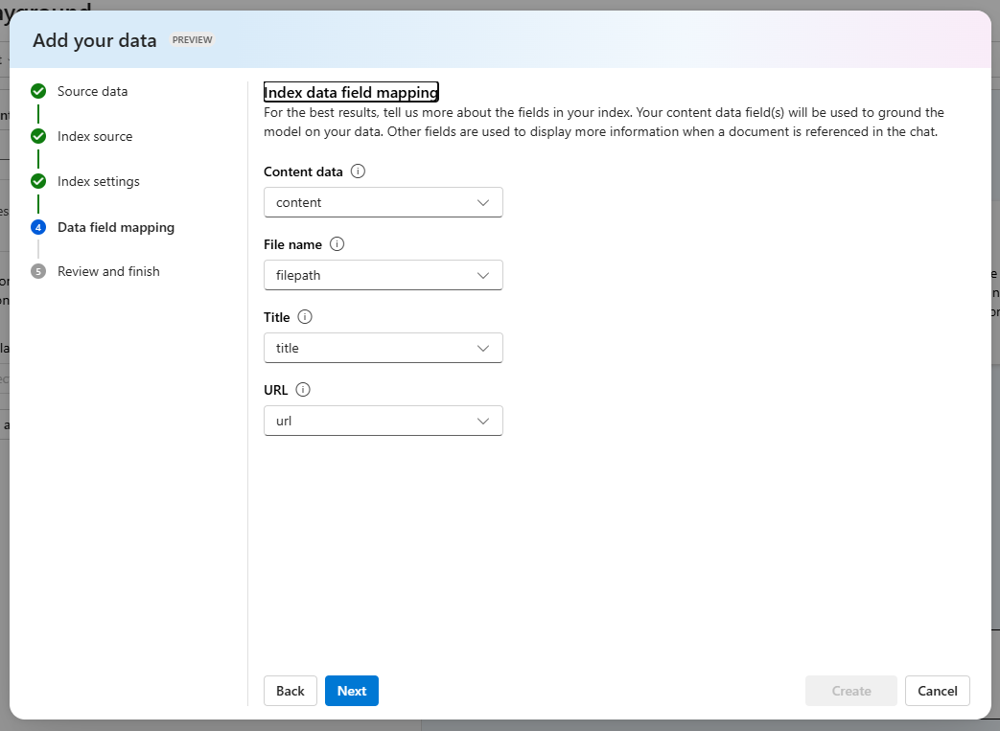

Adding your data can be done through the Azure AI Studio, in the **Chat** playground, or by specifying your data source in an API call. The data source you add is then used to augment the prompt sent to the model. When setting up your data in the studio, you can choose to upload your data files, use data in a blob storage account, or connect to an existing AI Search index.

If you're uploading or using files already in a storage account, Azure OpenAI on your data supports `.md`, `.txt`, `.html`, `.pdf`, and Microsoft Word or PowerPoint files. If any of these files contain graphics or images, the response quality depends on how well text can be extracted from the visual content.

When uploading data or connecting to files in a storage account, it's recommended to use the Azure AI Studio to create the search resource and index. Adding data this way allows the appropriate chunking to happen when inserting into the index, yielding better responses. If you're using large text files or forms, you should use the available [data preparation script](/azure/cognitive-services/openai/concepts/use-your-data#ingesting-your-data-into-azure-cognitive-search?azure-portal=true) to improve the AI model's accuracy.

Enabling [semantic search](/azure/search/semantic-search-overview?azure-portal=true) for your AI Search service can improve the result of searching your data index and you're likely to receive higher quality responses and citations. However, enabling semantic search may increase the cost of the search service.

You can also use the wizard in your AI Search resource to vectorize your data appropriately, which you'll walk through in this module's exercise. It takes a few extra steps compared to doing so in AI Studio, however serves as a good example of using the RAG pattern with an existing dataset.

## Connect your data in Azure AI Studio

To connect your data, navigate to the **Chat** playground in Azure AI Studio and select the **Add your data** tab. Select the **Add a data source** button to get your data connected. The prompts guide you through setting up the connection to each data source, and getting that data into a search index.

> [!TIP]
> If you are using the wizard in AI Studio to create and connect your data source, you will need to create a hub and a project, which aren't covered here. AI Studio will walk you through doing that, or refer to the [AI Studio documentation](/azure/ai-studio/concepts/ai-resources?azure-portal=true).

If you're using your own index that wasn't created through Azure AI Studio, one of the pages allows you to specify your column mapping. It's important to provide accurate fields, to enable the model to provide a better response, especially for **Content data**.

