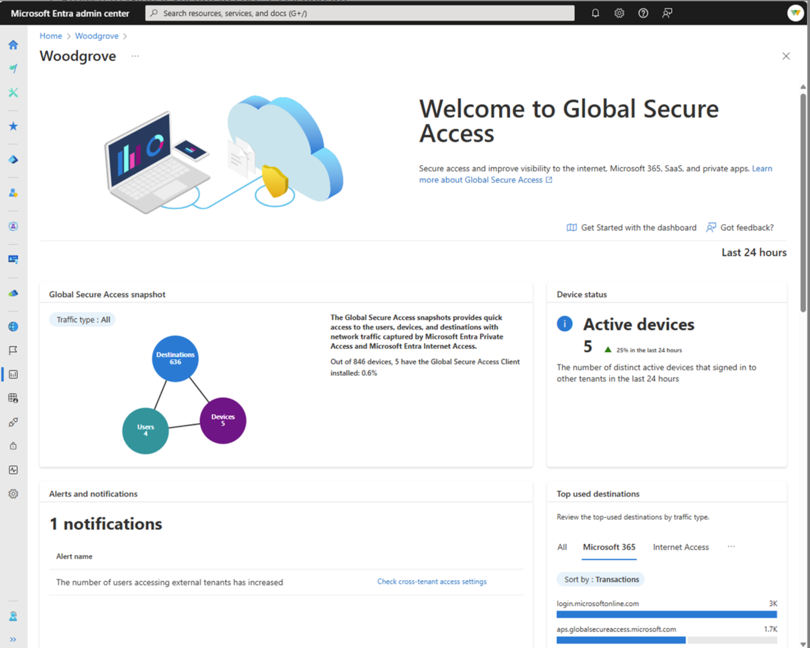

To access the dashboard:
1. Sign in to the Microsoft Entra admin center as a Global Secure Access Administrator.
1. Browse to Global Secure Access > Dashboard.

The Global Secure Access dashboard provides you with visualizations of the network traffic acquired by the Microsoft Entra Private and Microsoft Entra Internet Access services. The dashboard compiles the data from your network configurations, including devices, users, and tenants. The dashboard uses several widgets that provide you with visibility into several different types of data:
 - Volume of devices using the Global Secure Access client.
 - Change to the number of active devices.
 - Alerts that you should be aware of.
 - Service usage patterns.
 - Most used destinations.
 - Unique users are accessing the network across all your tenants.
 - Most popular website categories.
 - Most used private application segments.

## Global Secure Access snapshot
This widget provides a summary of how many users and devices are using the service and how many applications were secured through the service.
 - Users: The number of distinct users seen in the last 24 hours. The data uses the user principal name (UPN).
 - Devices: The number of distinct devices seen in the last 24 hours. The data uses the device ID.
 - Workloads: The number of distinct destinations seen in the last 24 hours. The data uses fully qualified domain names (FQDNs) and IP addresses.
The Global Secure Access snapshot has a filter to show data by Internet Access, Private Access, or Microsoft traffic.

## Alerts and notifications (preview)
This widget shows what is happening in the network and helps identify suspicious activities or trends identified by the network data. Common alerts are:
 - Unhealthy remote network: An unhealthy remote network has one or more device-links disconnected.
 - Increased external tenants activity: The number of users accessing external tenants increased.
 - Token and device inconsistency: The original token is used on a different device.
 - Web content blocked: Access to the website is blocked.
Navigate to a related alert detail page with additional information.

## Usage profiling (preview)
The Usage profiling widget displays usage patterns over a selected period of time. Select the Display by filter to view the following usage categories:
 - Transactions
 - Users
 - Devices
 - Bytes sent
 - Bytes received

## Top used destinations
The top-visited destinations widget shows all types of traffic and sorts by the number of transactions. You can select a different traffic type to narrow down the results. There are several filters available:
 - Transactions: The destinations with the highest number of transactions, showing the total number of transactions in the last 24 hours.
 - Users: The destinations most used by users, showing the number of distinct users (UPN) accessing the destination in the last 24 hours.
 - Devices: The destinations most used by devices, showing the number of distinct device IDs accessing the destination in the last 24 hours.
 - Bytes sent: The destinations (IP address) with the highest number of bytes sent, showing the total number of bytes sent in the last 24 hours.
 - Bytes received: The destinations (IP address) with the highest number of bytes received, showing the total number of bytes received in the last 24 hours.
Select the View all destinations button to see more details about the destinations.

## Cross-tenant access
Global Secure Access provides visibility into the number of users and devices that are accessing other tenants. This widget displays the following information:
 - Sign-ins: The number of sign-ins through Microsoft Entra ID to Microsoft services in the last 24 hours. This widget provides you with information about the activity in your tenant.
 - Total distinct tenants: The number of distinct tenant IDs seen in the last 24 hours.
 - Unseen tenants: The number of distinct tenant IDs that were seen in the last 24 hours, but not in the previous seven days.
 - Users: The number of distinct user sign-ins to other tenants in the last 24 hours.
 - Devices: The number of distinct devices that signed in to other tenants in the last 24 hours.
Select the **Configure tenant restrictions** button to navigate to the Session management are of Global Secure Access, where you can check the settings of your tenant restrictions.

## Web category filtering
The Web category filtering widget displays the top categories of web content that are blocked or allowed. These categories can be used to determine what sites or categories of sites you might want to block. Sort the results using the following categories:
 - Transactions: Shows the total number of transactions in the last 24 hours.
 - Users: The number of distinct users (UPN) accessing the destination in the last 24 hours.
 - Devices: The number of distinct device IDs accessing the destination in the last 24 hours.
Select View all web categories to view more details about your network traffic.

## Device status
The Device status widgets display the active and inactive devices that you deployed.
 - Active devices: The number of distinct device IDs seen in the last 24 hours and the % change during that time.
 - Inactive devices: The number of distinct device IDs that were seen in the last seven days, but not during the last 24 hours. The % change during the last 24 hours is also displayed.
