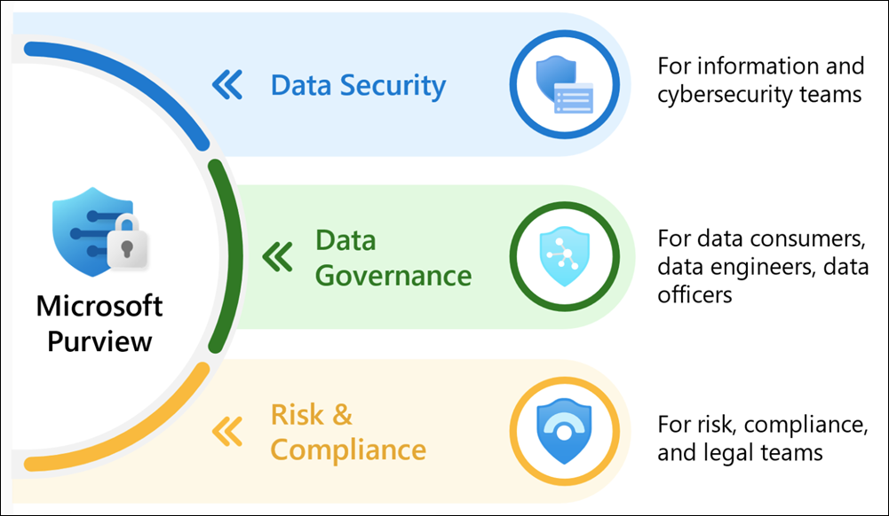

Microsoft Purview provides the highest and most flexible level of functionality for data governance in Microsoft Fabric.

In your health care provider, new regulations mean you need stricter governance for data stored in Microsoft Fabric. Now, you want to check that a Microsoft Purview subscription includes the features you need to comply with these requirements.

In this unit, let's find out what a Microsoft Purview subscription adds to Microsoft Fabric.

## What is Microsoft Purview?

Microsoft Purview is a robust data governance and compliance platform that you can use to manage and protect your company's data assets. It offers comprehensive tools for data discovery, classification, and cataloging. With Purview, you can gain a clear understanding of your data landscape. Purview automates the identification of sensitive information and provides a centralized repository for metadata. Use it to find, manage, and govern data across various environments, including both on-premises and cloud-based systems.

Purview also supports compliance and risk management with features that monitor regulatory adherence and assess data vulnerabilities. Its integration with other Microsoft services and third-party tools enhances its utility. By streamlining data access controls, enforcing policies, and delivering insights into data lineage, Purview helps organizations maintain data integrity, comply with regulations, and use their data effectively for strategic decision-making.

## What does Purview add to Fabric data governance?

Microsoft Purview is designed to work with Microsoft Fabric, and other Microsoft applications, so you can seamlessly discover and manage Fabric items in Purview tools. All you have to do is register your Fabric tenant in Microsoft Purview. Then the following functionality is available.

### Microsoft Purview Data Catalog

In the Data Catalog, users discover, understand, and manage their organization's data assets. You can search for and browse datasets, view metadata, and gain insights into the data’s lineage, classification, and sensitivity labels. The catalog promotes collaboration because users can annotate datasets with tags to improve discoverability and data governance.

Suppose, in your health care provider, regulations require you to control carefully who can access patient records. In the Data Catalog, users and administrators can:

- Discover where patient records are held by searching for keywords.
- Label documents and items as patient records to differentiate them from other, less sensitive information.
- Use access policies to manage self-service access requests to patient records.

### Microsoft Purview Information Protection

You use Information Protection to classify, label, and protect sensitive data throughout your organization. By applying customizable sensitivity labels, users classify records. Then policies can define access controls and enforce encryption. These labels follow the data wherever it goes, whether in emails, documents, or cloud storage, and integrate with other tools like Data Loss Prevention (DLP) to prevent unauthorized sharing. This helps organizations meet compliance requirements while safeguarding data against accidental exposure or malicious threats.

For your health care provider, use Information Protection to:

- Identify data items that contain patient information, even when item titles don't identify them as patient records.
- Train classifiers to spot patient records automatically.
- Protect records with policies to encrypt data and impose Information Rights Management (IRM).

### Microsoft Purview Data Loss Prevention (DLP)

DLP helps to protect sensitive information with policies that automatically detect, monitor, and control the sharing or movement of sensitive data. Administrators can customize rules to block, restrict, or alert when sensitive data is transferred to prevent accidental or malicious data leaks.

In your health care provider, you need to ensure that users don't share patient records with external parties, either accidentally or maliciously. DLP can prevent such transfers on information labeled as patient records.

> [!NOTE]
> Currently, DLP policies are only supported for Power BI semantic models.

### Microsoft Purview Audit

User activities such as creating files or accessing Fabric items are automatically logged and appear in the Purview audit log.

Thorough auditing is an important protection for the policies you have applied for patient records. For example, if a malicious administrator changes DLP policies so that they can copy a patient record to a USB device, this change is recorded and can be identified during later investigations.

## Learn more

- [Use Microsoft Purview to govern Microsoft Fabric](/fabric/governance/microsoft-purview-fabric)
