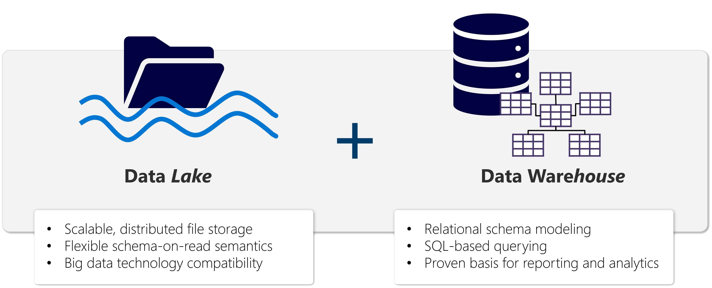

A **lakehouse** presents as a database and is built on top of a data lake using Delta format tables. Lakehouses combine the SQL-based analytical capabilities of a relational data warehouse and the flexibility and scalability of a data lake. Lakehouses store all data formats and can be used with various analytics tools and programming languages. As cloud-based solutions, lakehouses can scale automatically and provide high availability and disaster recovery.

Some benefits of a lakehouse include:

- Lakehouses use Spark and SQL engines to process large-scale data and support machine learning or predictive modeling analytics.
- Lakehouse data is organized in a *schema-on-read format*, which means you define the schema as needed rather than having a predefined schema.
- Lakehouses support ACID (Atomicity, Consistency, Isolation, Durability) transactions through Delta Lake formatted tables for data consistency and integrity.
- Lakehouses are a single location for data engineers, data scientists, and data analysts to access and use data.

A lakehouse is a great option if you want a scalable analytics solution that maintains data consistency. It's important to evaluate your specific requirements to determine which solution is the best fit.

## Load data into a lakehouse

Fabric lakehouses are a central element for your analytics solution. You can follow the ETL (Extract, Transform, Load) process to ingest and transform data before loading to the lakehouse.

You can ingest data in many common formats from various sources, including local files, databases, or APIs. You can also create Fabric **shortcuts** to data in external sources, such as Azure Data Lake Store Gen2 or OneLake. Use the Lakehouse explorer to browse files, folders, shortcuts, and tables and view their contents within the Fabric platform.

Ingested data can be transformed and then loaded using either using Apache Spark with notebooks or Dataflows Gen2. Use Data Factory pipelines to orchestrate your different ETL activities and land the prepared data into your lakehouse.

> [!NOTE]
> Dataflows Gen2 are based on Power Query - a familiar tool to data analysts using Excel or Power BI that provides visual representation of transformations as an alternative to traditional programming.

You can use your lakehouse for many reasons, including:

- Analyze using SQL.
- Train machine learning models.
- Perform analytics on real-time data.
- Develop reports in Power BI.

## Secure a lakehouse

Lakehouse access is managed either through the workspace or item-level sharing. Workspaces roles should be used for collaborators because these roles grant access to all items within the workspace. Item-level sharing is best used for granting access for read-only needs, such as analytics or Power BI report development.

Fabric lakehouses also support data governance features including sensitivity labels, and can be extended by using Microsoft Purview with your Fabric tenant.

> [!NOTE]
> For more information, see the [Security in Microsoft Fabric](/fabric/security/security-overview) documentation.
