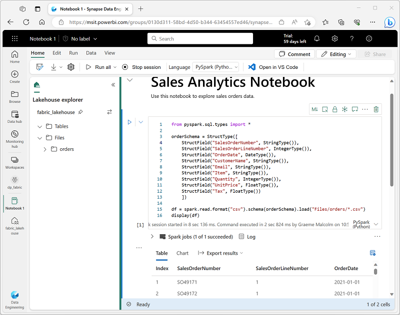
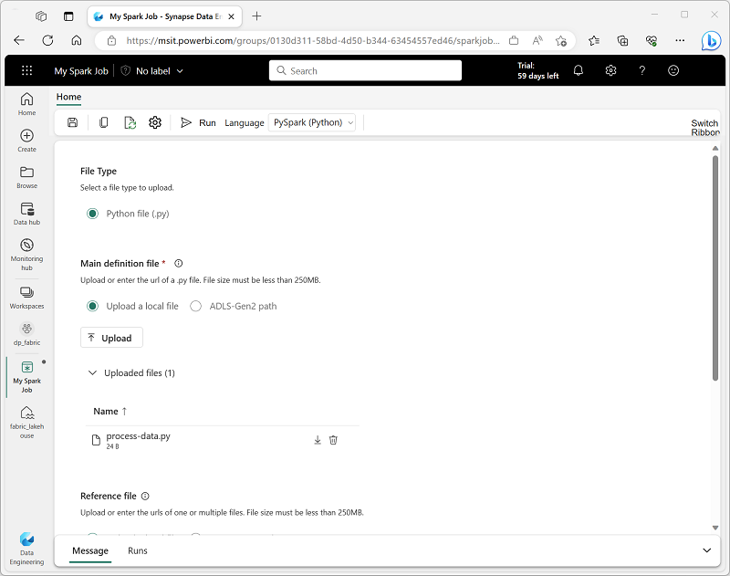

---
ms.custom:
  - build-2023
---
To edit and run Spark code in Microsoft Fabric, you can use *notebooks*, or you can define a *Spark job*.

## Notebooks

When you want to use Spark to explore and analyze data interactively, use a notebook. Notebooks enable you to combine text, images, and code written in multiple languages to create an interactive item that you can share with others and collaborate.

Notebooks consist of one or more *cells*, each of which can contain markdown-formatted content or executable code. You can run the code interactively in the notebook and see the results immediately.

## Spark job definition

If you want to use Spark to ingest and transform data as part of an automated process, you can define a Spark job to run a script on-demand or based on a schedule.

To configure a Spark job, create a Spark Job Definition in your workspace and specify the script it should run. You can also specify a reference file (for example, a Python code file containing definitions of functions that are used in your script) and a reference to a specific lakehouse containing data that the script processes.

